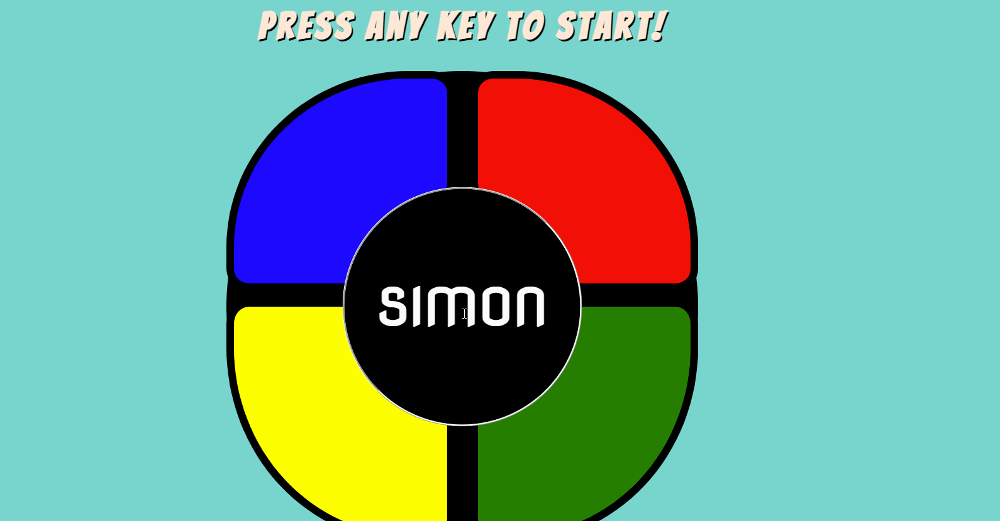

# Simon Memory Game

### App Description
The classic SIMON memory game in web-app form. This website allows a user to play the SIMON game by creating a never-ending light pattern
that the user must continue to guess correctly. The game activates when a keyboard button is pressed. When the pattern fails, the user loses and 
a new game can be restarted by pressing a new key.

### App Walk-though

 

## Required
- [x] User can start a new Simon Game.
- [x] A random pattern is created each time.
- [x] The user's answers are checked against the created pattern.
- [x] A wrong answer leads to a game over. There is no win state.
